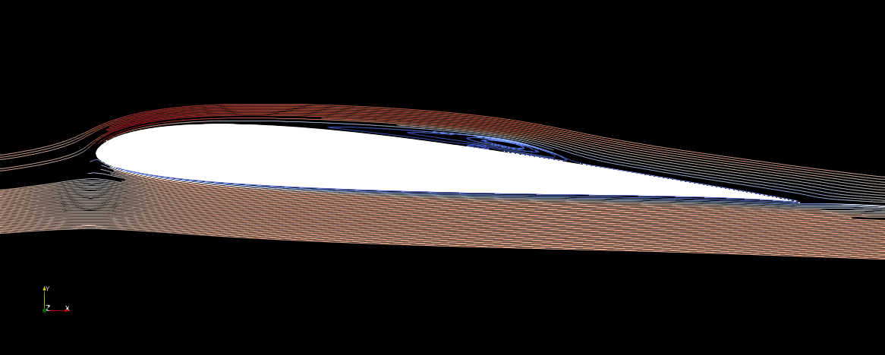

# Airfoil

It is one of the most complex and intersting case. The user has to create a proper mesh in [`gmsh`](https://gmsh.info/) setting the following physical boundaries:
- `inlet` for the inlet
- `outlet` for the outlet
- `airfoil` for the airfoil walls
- `limits` for the top and bottom boundaries

The velocity at the inlet is incresed from `0.0` arriving to the target value `u_in` at `:t_endramp`. This increase the numeric stability. If `:t_endramp` = `:t0` the velocity at the inlet will be immediately `:u_in`. For numeric stability is better to keep `u_in = 1.0`, then fix the Reynolds and so the viscosity will be automatically computed as: `ν = 1/Reynolds`

The pressure is set `0.0` at the `outlet` section. The velocity on the `limits` is set equal to the one at `inlet`.

